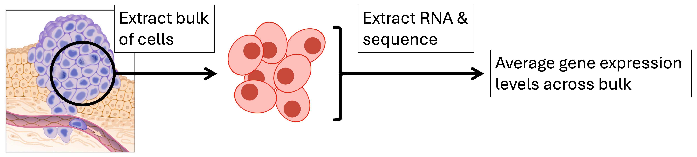
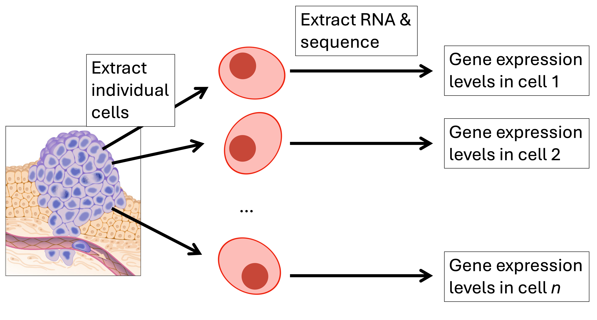

# Analyzing Single Cell Sequencing Data

## Background
In the early stages of next-generation sequencing, all protocols were bulk sequencing approaches.
In bulk sequencing, a part of a tissue of interest is extracted, from which the DNA or RNA is isolated and analysed as a single unit.
This means that expression levels of genes represent the average expression values across all cells in the analysed bulk.
This is not ideal for transcriptomic analyses, as different celltypes with different gene expression profiles are typically present in each sample.



To address this issue, single-cell sequencing approaches were developed.
In single-cell RNA sequencing (scRNAseq), individual cells are extracted from a tissue or sample of interest. 
From each of these cells, the RNA is extracted and sequenced separately.
The resulting dataset now contains information on individual cells.



## Project overview
The aim of this project is to introduce a basic workflow to analyse scRNAseq data.
In the first part, you will align sequencing reads to the human reference genome using the STARSolo software.
This will result in a count matrix that record how many sequencing reads were mapped to each transcript (i.e., gene product) in the sample.
This count matrix is the basis for downstream analysis in software specifically designed to analyse single cell sequencing gene expression data.
There exist several software suites that perform this type of analyses, with some of the most widely used being Seurat (R) and ScanPy (Python). 
There are already many excellent tutorials on analysing single-cell count matrices using these softwares, so we will provide links to some of these below.
You can pick one of these to follow based on your programming language of preferences.

## Tasks
### TASK 1: Work through a tutorial on pre-processing and clustering a scRNAseq experiment
As mentioned above, there are many options available to us to continue with the analysis at this point.
Typical steps that most options will include are:
- Removing low-quality cells (based on mitochondrial gene counts, number of detected genes, total number of detected molecules).
- Normalizing & scaling the data.
- Dimensionality reduction (PCA, UMAP).
- Clustering & cell type assignment.

We suggest that you follow one of the two following tutorials, based on whether you prefer R or Python.
Please refer to the documentation of these tools directly for information on how to install them and get started.
1) The [Guided Clustering Tutorial](https://satijalab.org/seurat/articles/pbmc3k_tutorial.html#identification-of-highly-variable-features-feature-selection) by [Seurat](https://satijalab.org/seurat/), which uses R.
In this tutorial, you will analyse a count matrix based on the PBMC-3K dataset you use in Task 1 (but the full set instead of a subset).
2) The [Preprocessing and clustering](https://scverse-tutorials.readthedocs.io/en/latest/notebooks/basic-scrna-tutorial.html) tutorial by [Scanpy](https://scanpy.readthedocs.io/en/stable/index.html), which uses Python.
This tutorial uses a different dataset, but this should not matter for your understanding of the workflow.

### TASK 2: Run STARSolo to generate a gene expression count matrix
On the earth cluster, there is a shared folder for the Bioinfo4B course.
Connect to the cluster, and navigate to this folder (`cd /cfs/earth/scratch/shared/bioinfo4beginners/`).
In this shared folder, there is a subdirectory called `single_cell`.
Go there now (`cd single_cell`).
This folder again contains several subdirectories with the following contents:
```bash
|-- barcodes
|   `-- 3M-february-2018.txt
|-- bin
|   `-- STAR
|-- genome_idx
|   |-- chrLength.txt
|   |-- chrNameLength.txt
|   |-- chrName.txt
|   |-- chrStart.txt
|   |-- exonGeTrInfo.tab
|   |-- exonInfo.tab
|   |-- geneInfo.tab
|   |-- Genome
|   |-- genomeParameters.txt
|   |-- Log.out
|   |-- SA
|   |-- SAindex
|   |-- sjdbInfo.txt
|   |-- sjdbList.fromGTF.out.tab
|   |-- sjdbList.out.tab
|   `-- transcriptInfo.tab
`-- reads
    |-- subset100k_pbmc_1k_v3_S1_L001_R1_001.fastq.gz
    `-- subset100k_pbmc_1k_v3_S1_L001_R2_001.fastq.gz
```

These files represent all the data and software we'll need for this task.
For example, the STAR alignment program is installed in the `./bin` directory.
You can confirm this by running `./bin/STAR --version`, which should print the STAR version number to the terminal.
STAR needs a genome index to run (all the files stored in `genome_idx`), as well as a list of accepted barcodes (in `barcodes`).
Finally, we will of course need some biological sequencing data to analyse.
This is contained in the two `fastq` files stored in `reads`.
If you want, you can read more about the STAR program and the inputs it required by checking [GitHub](https://github.com/alexdobin/STAR) or the [manual](https://physiology.med.cornell.edu/faculty/skrabanek/lab/angsd/lecture_notes/STARmanual.pdf) (especially 'Section 1.2 Basic workflow').
Note, however, that this is only required if you want to know more about STAR.
For this task, the commands to run the program are provided in a script (see next section).

#### Running STARSolo on the HC

The commands to run STARSolo on the earth cluster are implemented in the script `run_STARSolo.sh`, which is located in the [scripts](./scripts/) directory on GitHub.
Take some time to read through this script to get a rough idea of what a STARSolo alignment command looks like.
Then, when you're ready, navigate to your home folder on the cluster, download the script, and submit it to the workload manager:

```bash
cd $LSFM_CLUSTER_SCRATCH_USER_PATH
curl -LO https://raw.githubusercontent.com/acg-team/Bioinfo4B/refs/heads/main/Project/single_cell/scripts/run_STARSolo.sh 
sbatch ./run_STARSolo.sh
```

This is expected to take around 2.5 - 3.5 minutes to run. 
You can check on the status of your job by running `squeue -u $(whoami)`.
It should be noted that this job will be quite fast because we are running on only a small amount of input data (100k reads) and are mapping only to chromosome 22, which is the smallest autosomal chromosome.
If we were analysing a typical single cell sequencing dataset and reference genome, running STAR would take several hours with more CPUs and RAM than we are currently using.
1kpmbc_Solo.out
By default, the results of the run will be collected in a directory called `1kpbmc_Solo.out`, which will be stored in your home directory once the run is finshed (run `echo ${HOME}` to see the full path to your home directory).
This can be changed by setting the OUTPUTDIR environment variable before running the script, e.g. `OUTPUTDIR="/some/other/directory/" sbatch ./run_STARSolo.sh`.
The contents of `1kpbmc_Solo.out` will look like this:
```bash
|-- Barcodes.stats
`-- Gene
    |-- Features.stats
    |-- filtered
    |   |-- barcodes.tsv
    |   |-- features.tsv
    |   `-- matrix.mtx
    |-- raw
    |   |-- barcodes.tsv
    |   |-- features.tsv
    |   `-- matrix.mtx
    |-- Summary.csv
    `-- UMIperCellSorted.txt
```
The `raw` and `filtered` directories each contain three files representing the raw and filtered gene expression count matrices, respectively.
These files could now be loaded into Scanpy or Seurat to perform the workflow you performed in the previous task.
If you're interested, you can see if you can figure out how to do this.
Although the results will not be very meaningful since we only analysed a small amount of data and one chromosome, it could still be a good exercise!


## Appendix: Data and Software sources
#### Generating a STAR index for chromosome 22
```bash
# Get UCSC gene annotations for hg38
curl -LO https://hgdownload.soe.ucsc.edu/goldenPath/hg38/bigZips/genes/hg38.knownGene.gtf.gz

# Download UCSC assembly of hg38 chromosome 22
curl -LO https://hgdownload.soe.ucsc.edu/goldenPath/hg38/chromosomes/chr22.fa.gz 

gunzip *.fa.gz

# Generate index
mkdir genome

STAR \
    --runThreadN 4 \
    --runMode genomeGenerate \
    --genomeDir ./genome/ \
    --genomeFastaFiles ./chr22.fa \
    --sjdbGTFfile ./hg38.knownGene.gtf \
    --sjdbOverhang 100 \
    --genomeSAindexNbases 11
```

#### Whitelist of barcodes for STAR
```bash
curl -L https://github.com/pachterlab/kite/blob/master/docs/3M-february-2018.txt.gz?raw=true > 3M-february-2018.txt.gz
gunzip 3M-february-2018.txt.gz
```
#### Single-cell sequencing data
The single cell sequencing data that we used as input is freely provided by [Cellranger](https://www.10xgenomics.com/datasets/1-k-pbm-cs-from-a-healthy-donor-v-3-chemistry-3-standard-3-0-0).
It was downloaded and subsetted to 100,000 reads as follows:

```bash
curl -LO https://cf.10xgenomics.com/samples/cell-exp/3.0.0/pbmc_1k_v3/pbmc_1k_v3_fastqs.tar
tar -xvf pbmc_1k_v3_fastqs.tar pbmc_1k_v3_fastqs/pbmc_1k_v3_S1_L001_R1_001.fastq.gz pbmc_1k_v3_fastqs/pbmc_1k_v3_S1_L001_R2_001.fastq.gz
zcat pbmc_1k_v3_fastqs/pbmc_1k_v3_S1_L001_R1_001.fastq.gz | head -n 400000 | gzip > subset100k_pbmc_1k_v3_S1_L001_R1_001.fastq.gz
zcat pbmc_1k_v3_fastqs/pbmc_1k_v3_S1_L001_R2_001.fastq.gz | head -n 400000 | gzip > subset100k_pbmc_1k_v3_S1_L001_R2_001.fastq.gz
```